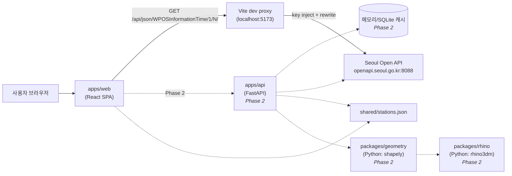
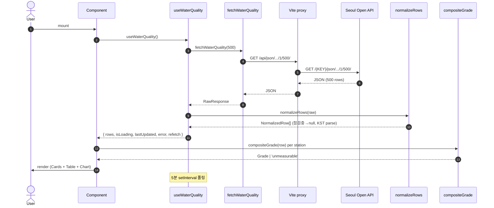
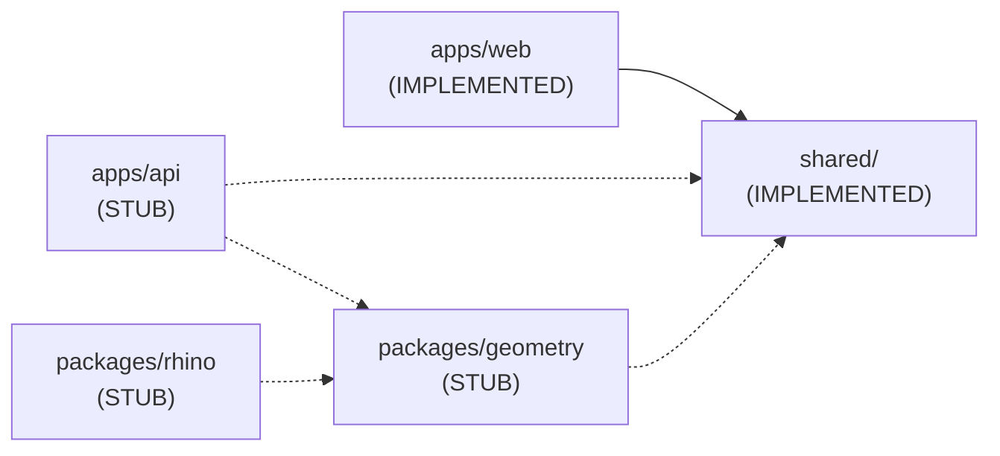

# 시스템 아키텍처

`docs/dashboard.html` §1~§3의 텍스트 미러. GitHub에서 그대로 Mermaid 렌더링 됨.

## 1. 시스템 다이어그램 (Phase 1: 점선 = Phase 2 계획)

## 2. 데이터 파이프라인 (시퀀스)

## 3. 모듈 책임

| 모듈 | 책임 | 상태 | 언어 | 의존성 |
|------|------|------|------|--------|
| `apps/web` | React SPA: 시각화 (Cards, Table, Chart). 정규화·등급 계산은 클라이언트 lib에서 | Implemented | TypeScript + Vite | shared/ (Phase 2부터 apps/api) |
| `apps/web/src/types/` | 도메인 타입 (Measurements, NormalizedRow, Grade) — React 비의존 | Implemented | TypeScript | — |
| `apps/web/src/lib/` | 순수 함수 (api, normalize, grade) — React 비의존, Phase 2 백엔드 재사용 가능 | Implemented | TypeScript | — |
| `apps/web/src/hooks/` | useWaterQuality (5분 폴링 + refetch) | Implemented | TypeScript + React | lib/ |
| `apps/web/src/components/` | Header, LatestTable, TimeSeriesChart, StationGradeCards | Implemented | TypeScript + React + Recharts | types/, lib/ |
| `apps/api` | FastAPI: Open API 호출 + 캐싱 + REST 엔드포인트. Vite 프록시 대체 | **Stub** | Python | shared/ |
| `packages/geometry` | shapely/geopandas: 측정값 + 좌표 → geometry | **Stub** | Python | shared/ |
| `packages/rhino` | rhino3dm / Rhino.Compute: geometry → .3dm | **Stub** | Python | packages/geometry |
| `shared/` | 언어 중립 자산. 현재 `stations.json` (측정소 메타) | Implemented | JSON | — |
