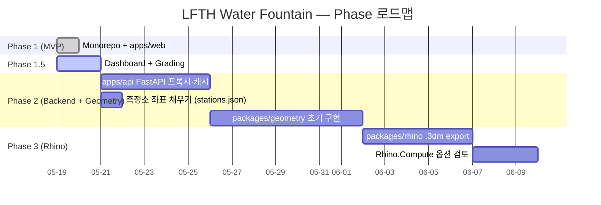

# 로드맵

`docs/dashboard.html` §4 의 텍스트 미러.

## Phase 1 — MVP (완료)
- Vite + React + TS 스캐폴드, Recharts
- Open API 직접 호출 (Vite dev proxy)
- 측정소별 최신값 테이블 + 24h 시계열 차트
- 5분 자동 폴링 + 수동 새로고침
- 모노레포 구조 확정, Phase 2 모듈은 README 스텁

## Phase 1.5 — Dashboard + Grading (진행중)
- 협업/보고용 HTML 대시보드 (`docs/dashboard.html`)
- 환경정책기본법 시행규칙 별표 1 기반 등급 평가
- 측정소별 종합 등급 카드 4장
- LatestTable 등급 색 dot
- TimeSeriesChart 등급 경계선
- ADR 3개 (HTML dashboard / worst-of grading / threshold duplication)
- docs/ 보조 markdown 파일 (architecture, grading, seoul-api, roadmap, STATUS, decisions)

## Phase 2 — Backend + Geometry (계획)
- `apps/api` FastAPI 도입 → Vite 프록시 대체, production 배포 가능
- 측정값 + 캐싱 + REST 엔드포인트
- `shared/stations.json`에 측정소 좌표 채움 (검증된 출처)
- `packages/geometry`: shapely/geopandas로 측정소 포인트 + 등급 색 polygon
- `apps/web`은 base URL만 환경변수로 교체

## Phase 3 — Rhino 연동 (계획)
- `packages/rhino`: rhino3dm으로 헤드리스 `.3dm` export (1차)
- Rhino.Compute REST 옵션 검토 (Grasshopper 정의 자동 실행 필요 시)
- 로컬 Rhino 소켓 브릿지 (실시간 라이브 연동, 옵션)
